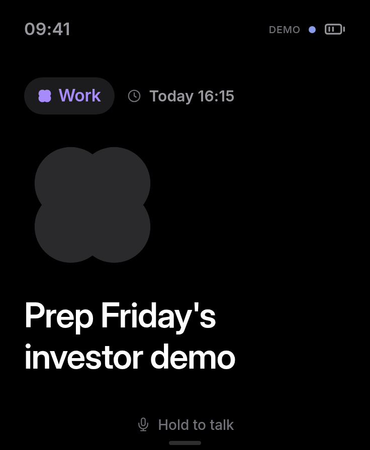
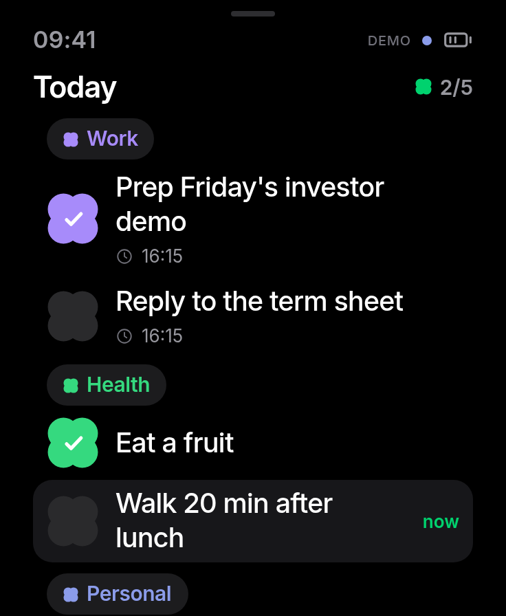
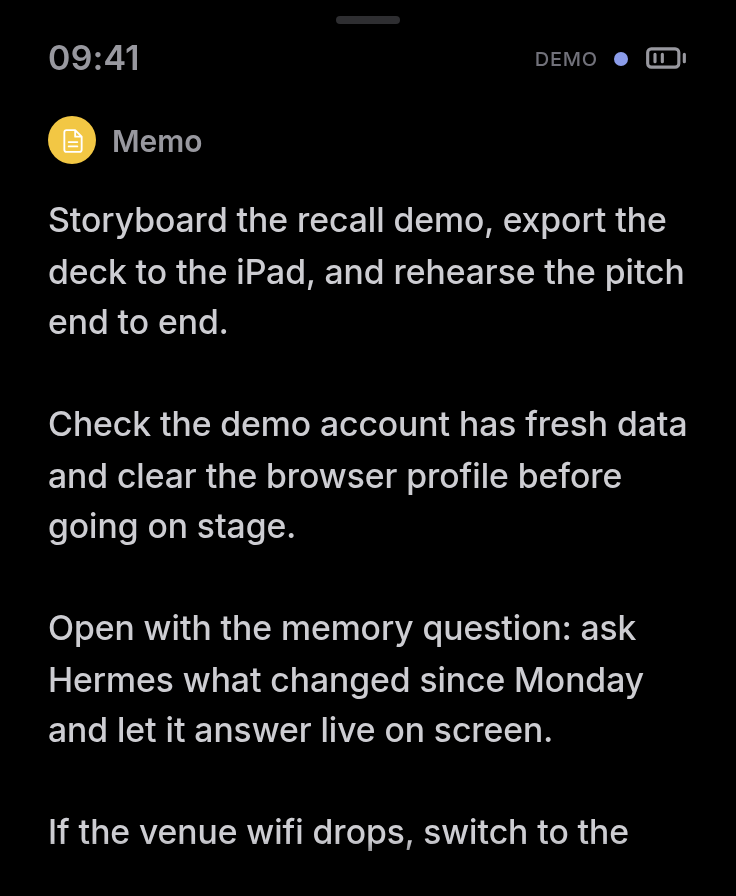
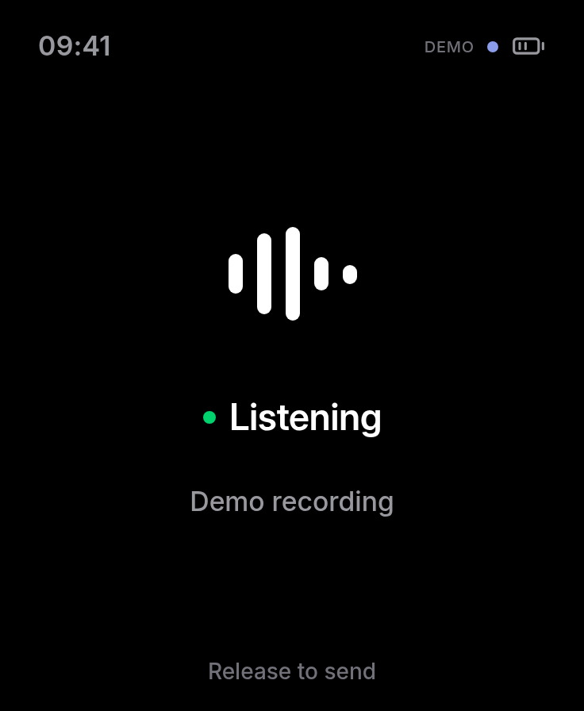
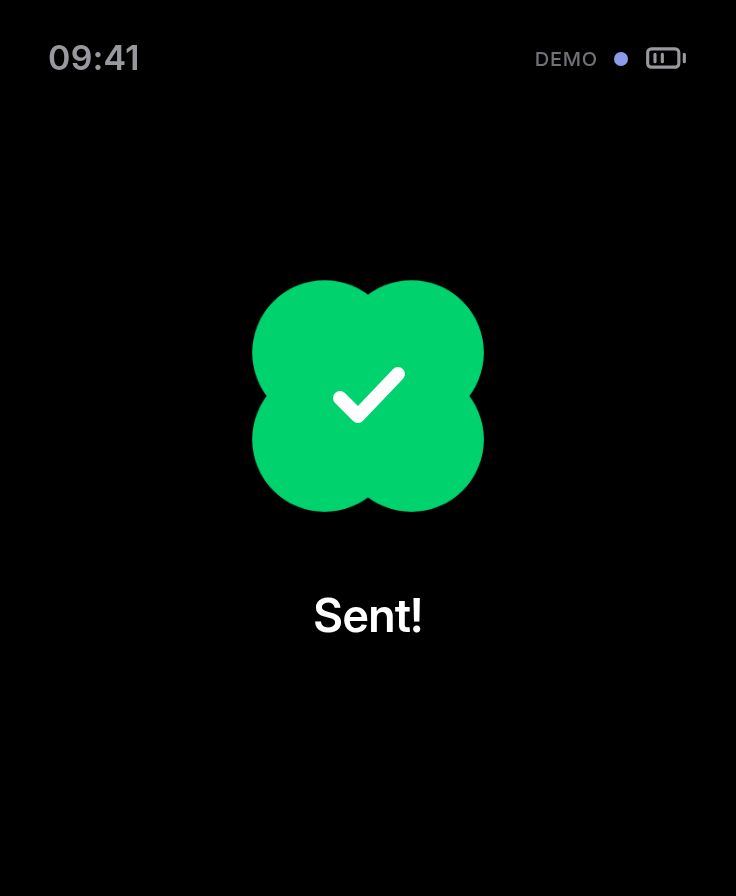

# Alfred

A pocket assistant for the Waveshare **ESP32-S3-Touch-AMOLED-1.8**: a clean
368 × 448 task display with touch completion, scrolling memos and push-to-talk
to your existing Matrix chat with Hermes.

Voice is one-way: record → upload → **Sent!** → back to your task.
Alfred does not transcribe audio, synthesize speech or read assistant replies.

The [pocket app](apps/pocket/README.md) includes a browser preview, Bun backend,
a persistent encrypted Matrix voice bridge, and [native firmware](apps/pocket/firmware/README.md).
Cloud credentials stay on the backend. With no credentials, it runs an interactive demo.

| Focus                                                                                      | Today                                                                                        | Memo                                                                           | Recording                                                                        | Sent                                                                                      |
| ------------------------------------------------------------------------------------------ | -------------------------------------------------------------------------------------------- | ------------------------------------------------------------------------------ | -------------------------------------------------------------------------------- | ----------------------------------------------------------------------------------------- |
|  |  |  |  |  |

Actual app preview at the device’s 368 × 448 layout, using demo data.

```sh
bun install --frozen-lockfile
bun run dev                 # http://127.0.0.1:9191
bun run firmware:build      # PlatformIO, board V1
bun run firmware:flash      # connected ESP32
```

The Docker workflow tests changes and publishes `ghcr.io/mathix420/alfred` from
the default branch and version tags. See [Portainer setup commands](deploy/PORTAINER.md) and [Matrix setup](apps/pocket/README.md).
Local `.env` files, recordings, crypto stores and design references are excluded from Git.
